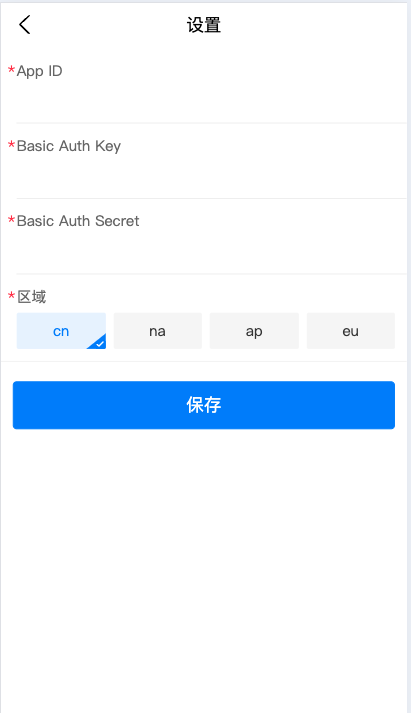
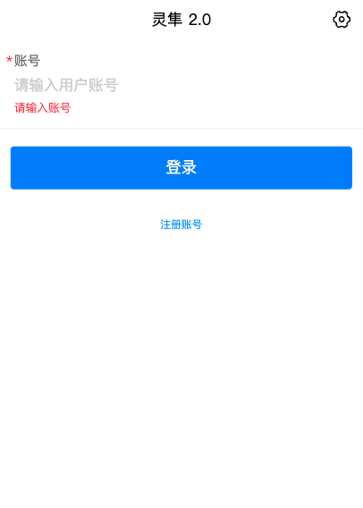
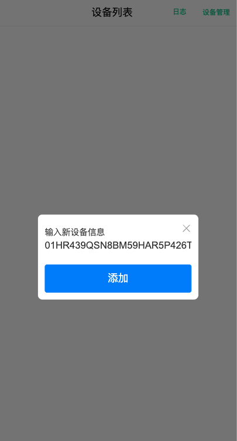
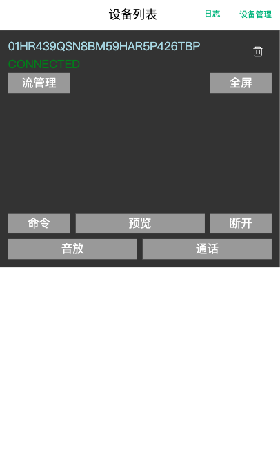
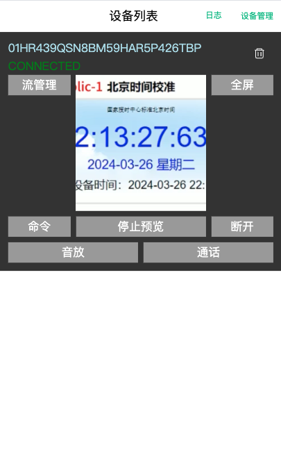

### Demo测试连接

[在线链接](https://agoraio.github.io/agora-iot-callkit-web//#/)

### 部署及运行示例项目
web端示例项目进入子目录（examples/web）运行命令：pnpm install  安装依赖包，运行命令: pnpm start 进行demo的调试和运行。 

### 应用配置
通过“开通并配置灵隼服务”来获取自己项目的appId。 示例程序运行时需要配置用户自己申请的appId，首次运行时，需要配置相应的 appId
, Basic Auth key,  Basic Auth Secret 等如下图，具体方式：登录页→ 右上角设置icon

### 客户端身份获取
web端的身份获取，相当于用户账号系统中注册一个新的用户账号，用户账号与 APP端的NodeId绑定。在示例程序中，应用层简单模拟了用户账号注册，输入任意字符串进行新账号注册。当新账号注册成功后，分配了一个客户端身份的NodeId，与该账号进行绑定。

### 客户端身份的令牌申请
当客户端身份获取后，还需要申请相应的令牌信息，才能进行后续的操作。相当于用户账号系统中使用用户账号进行登录。在示例程序中，应用层简单模拟了用户账号登录。登录成功后，则进入设备操作的主界面。

### 添加设备端
注意：为了方便业务流程的展示，在示例项目中实现了类似绑定设备的相关功能，实际上声网灵隼并不提供绑定管理相关业务，集成时，客户必须参考授权码使用（设备端）实现绑定管理业务的接入。

Demo启动后，需要先添加设备信息才能实现音视频通话，通过右上角"设备管理"按钮中的"添加设备"，输入设备对应的NodeId来进行添加。

### 开始通话
设备添加成功后，可以点击设备界面上相应的按钮进行预览和通话。通常会先点击"连接"按钮进行设备连接，连接成功后，再点击"预览"按钮即可观看设备端BROADCAST_STREAM_1流的实时视频，点击"音放"按钮则播放设备端的音频。

